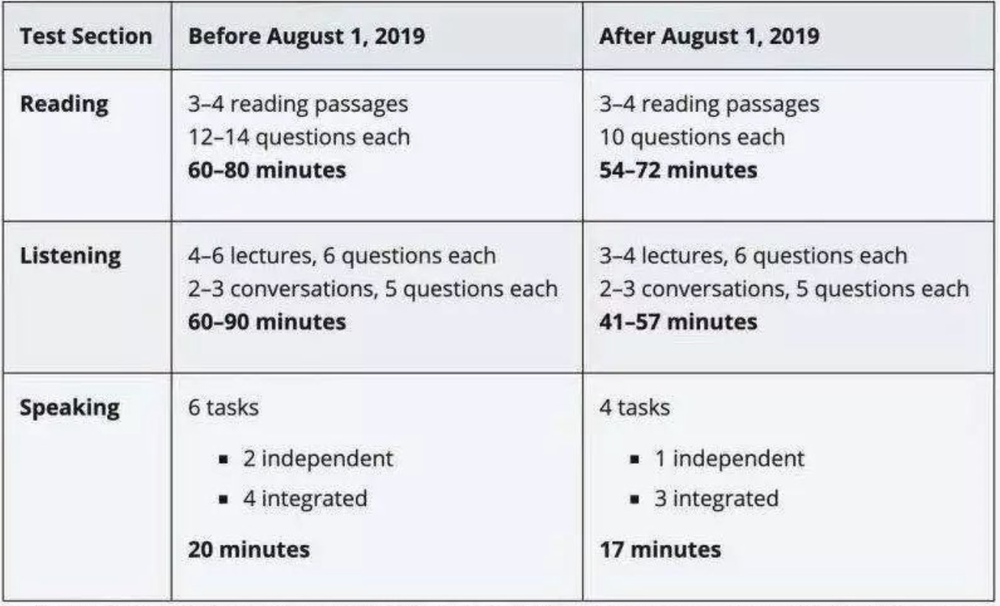

# N 战 TOEFL 经验总结

## 成绩汇总

> 98 - December 06, 2020
>
> 99 - May 22, 2021
>
> 101 - September 19, 2021
>
> 108 (L:29, R: 30, S: 23, W: 26) - October 23, 2021

首先还是建议大家早考，能用两年，和申请、GRE 挤在一起真的焦头烂额。

从申请的角度来说，考到 105 基本就没有学校再卡了。但是 Speaking 最好还是到 24 分。

## 关于先 TOEFL 还是先 GRE

根据我的个人经验，我建议**先 G 后 T**。首先是 G 的成绩能用 5 年，其次是在备考过 G 的情况下，备考 T 的时候几乎不用考虑单词问题，难度可以大大降低。当然在这个问题上也是见仁见智，很多朋友都是先 T 后 G 成绩也很好。

## 备考资料

- 刷题: **小站托福 TPO**, 强推，新东方也是一个选择，但是小站可以**倍速播放**和**精听**。
- 单词: 词以类记？不确定，因为我在考过 G 后没怎么背过托福单词。这本给不同种类的单词分了不同 list，可以专注于某一种类型（生物，天文）的单词。
- 口语: **[《托福口语看这本就够了》](https://github.com/F4bwDP6a6W/FLY_US/blob/master/%E6%89%98%E7%A6%8F/%E5%8F%A3%E8%AF%AD/%E5%BC%A0%E6%B6%B5%E3%80%8A%E6%89%98%E7%A6%8F%E5%8F%A3%E8%AF%AD%E7%9C%8B%E8%BF%99%E6%9C%AC%E5%B0%B1%E5%A4%9F%E4%BA%86%E3%80%8B.pdf)**，强推，忽略**已被删除**的 Task 1 与 Task 5。

## 备考经验

### 刷题

考试的流程为: `Reading, Listening` => 休息 10 分钟 => `Speaking, Writing`。

平时刷题的时候最好按照这个顺序来提前适应考场，注意是两项连续考中间没有休息！

也要考虑到加试，加`Reading`问题不大，但是`Listening`真的累，刷题时最好多刷一个 Section(一篇 Conversion，两篇 Lecture)来适应。

### 单词

单词是 TOEFL 的非常重要，但是个人感觉因为在城大的英语教学，这方面并不是相当困难。底子不错的同学只需要背一下**生物**和**天文**相关的（这方面生词比较多）就够了，其他的单词都可以在刷题时稍微背下就够。

:::tip
但如果你发现听力材料，或者 Reading 的文章中很多词不认识，最好先是提高词汇量，不要浪费 TPO。
:::

### Listening

听力是 TOEFL 的重中之重，因为除了`Reading`部分，其他部分均涉及听力。我之前几次的成绩不好，也全是因为听力拉垮。以下是我总结出来的几点经验:

#### 1. 刷 TPO 就够了

不用考虑看美剧或者类似的，纯浪费时间，刷 TPO 就完事。平时路上可以把`60-Second Science`当背景音，主题与考试主题比较接近，适合泡脑子。

#### 2. 记笔记

:::tip
有些关键名词听不懂没关系，放平心态记，写拼音都行。如果真的考了，当你在题目里看到这个词的时候也能匹配上。
:::
一定要记笔记，Conversion 比较短还好，Lecture 太长了真的会忘记文章的整体脉络和一些细节，尤其是后面听累了的时候。

记得时候**记录文章的主旨和逻辑关系，以及细节部分**。并不是要把全篇每个句子记下来。

- **Conversion:** 下面两种基本必考，千万不要主次不分。

  - **主旨题**：学生找老师是为了干啥，或者老师找学生是为了干啥，建议之后怎么做。
  - **细节题**：老师打岔，或者学生打岔说了某些内容。

- **Lecture:** 把握主旨，细节可能有疏漏，但主旨一定要清楚。
  - 考试时候**屏幕上会有字**，记得看一下并且记下来。可以让你掌握文章的架构，并且不因为没有听清理解错听的内容。
  - **把握逻辑关系**：时间，对比等。所有的转折词都是出题重点。
  - **学生打岔**：基本必考，仔细记。

#### 3. 倍速练习

**感觉这是我听力提高最重要的方法**。平时练的时候最好用`1.25`或者`1.5`倍速训练，小站托福在听力和精听时均支持这个功能。适应了以后，考试的笔记基本可以写的很详细，听的也基本一清二楚。而且也可以节省你平时的时间。

#### 4. 不会重复考察

同一个点不会考两个题，实在不确定，蒙的时候可以用来排除。

### Reading

大家应该都比较擅长，唯一的丢分点就是**单词题**。会有一些熟词生义，或者意思很接近的干扰项，比如`founder`有`失败`的意思。如果你不知道，就需要去文中仔细分析。

个人感觉在准备完 GRE 之后，单词题可以直接秒做，很节约考试时间。

最后一个主旨题的题目顺序，和文章顺序基本对应，不要漫无目的的通篇找。

### Speaking

我考的也很差，只说几点给大家借鉴。

- **早准备**: 初期备考的时候就可以拿老题来训练，每天练一点，不要挤在最后，效果很差。
- **了解题型**: 推荐阅读[《托福口语看这本就够了》](https://github.com/F4bwDP6a6W/FLY_US/blob/master/%E6%89%98%E7%A6%8F/%E5%8F%A3%E8%AF%AD/%E5%BC%A0%E6%B6%B5%E3%80%8A%E6%89%98%E7%A6%8F%E5%8F%A3%E8%AF%AD%E7%9C%8B%E8%BF%99%E6%9C%AC%E5%B0%B1%E5%A4%9F%E4%BA%86%E3%80%8B.pdf)。掌握一些回答套路。
- **录音/两人对练**：听一下就能发现自己哪里说得稀烂，可以重点突破。

最后建议大家去看看[这个视频](https://www.bilibili.com/video/BV1i3411h7y3?share_source=copy_web)，很短干货很多。

### Writing

**字要多，但留两分钟检查**。字多分真的会高，但是低级错误多了分反而会低。

我代码打的导致我打字比较快，基本是在`85WPM` 左右，所以我长作文大概会写`500`多词，短作文大概`300`多。

两者之间如何权衡大家根据自己的情况考量，但一定要留两分钟查查三单，复数，或者一些 typo。

#### 综合写作

**不需要记阅读材料的内容，写的时候还可以看到！**

我的写作结构基本是:

1. 引入（文章说了啥主题，听力反驳了这一点/听力 reinforce 了这一点）
2. 文章第一部分，听力第一部分
3. 文章第二部分，听力第二部分
4. 文章第三部分，听力第三部分
5. 可以不写总结，时间不多最好去检查

写文章内容的时候，**千万不要照抄**！尽量用高级句型，词语进行替换，而且不要太冗长。

听力的笔记一定要细致，他的主题和例子都要记下来。写的时候你哪怕是照抄下来都无所谓。

这样你基本随便就写到`300`多词了，不用在意他题目中说的建议`100多~225`词。

#### 独立写作

主体部分就是高考时候写议论文的套路，`总分总+三个论点`。但是：

- 开头可以炫技，但别啰嗦，直接把你的主题给出来。
- 逻辑链一定要清晰，举的例子要真正的支持你的论点！

剩下的只能靠大家平时多积累一些好句式和单词了。在备考的时候最好初期就开始准备写作，像口语一样。总结出来一个**最适合自己的模板**，抄网上的模板容易被**查重**导致特别低分。

## 考场注意事项

### 多穿衣服

我线下考都是在香港考的，平心而论冷的离谱。我第一次考试写作手快冻僵了，打字特别慢，所以最好还是多穿点。

### 注意加试

一定要注意加试，我第一次加试的是阅读，剩下的都是听力。应该不会加口语？

因为不确定哪一个部分是不记分的加试内容，所以每个部分都要全神贯注。

### 托福改革

因为 19 年改革，题型有所变化，请千万不要向着错误的方向准备。比如阅读是**18 分钟**而不是 20 分钟，以下为具体内容:

## 写在最后

每个人的词汇量、语感、学习方法都是不同的，这导致一个人的经验不一定适用于另一个人。但无论采用什么备考方法，只要努力花时间去做了，严格按计划执行了，就都会得到应有的回报。希望各位能从这篇经验里学到那么点东西，结合自己的努力，最终考出理想的成绩！
